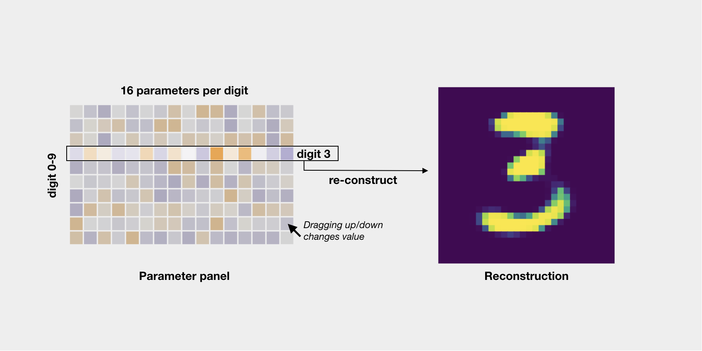

# Visualizing Capsule Networks

## How to start
To start, run an http server under viz/ e.g.

```
cd vis
http-server
```

## User interface
### Explanation


## TODOs
- Fix parameter range to [min, max] of samples
- Add a global color bar and parameter value when parameter changes (changes on hovering different cell)
- Small histograms / KDEs for each parameter (then drag left/right to change values)
- A history of images generated (e.g. recent 20 images). Also record their parameters so that one can restore.

## Open questions
- How to understand dynamic routing?